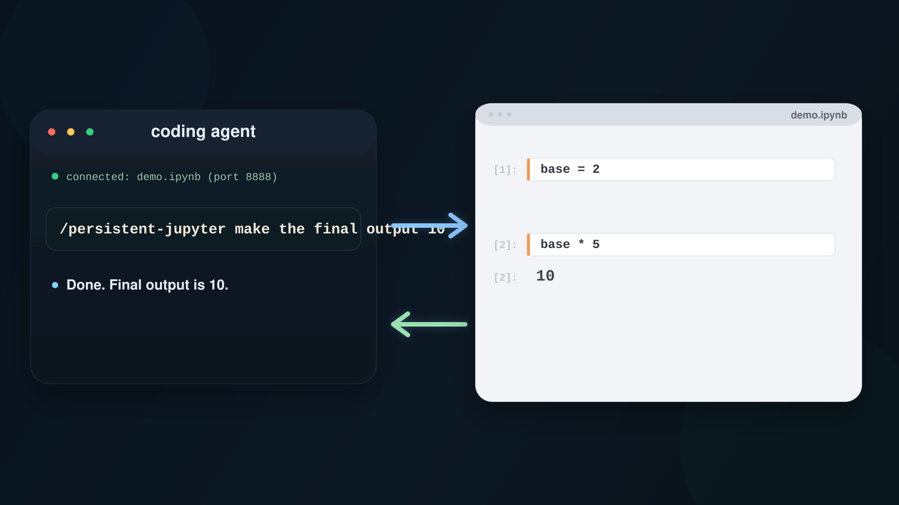

# persistent_jupyter

[](https://github.com/rwollman/persistent_jupyter/actions/workflows/fast-tests.yml)
[](https://github.com/rwollman/persistent_jupyter/actions/workflows/full-tests.yml)

This project is derived from [`hamelsmu/hamelnb`](https://github.com/hamelsmu/hamelnb). The fork keeps the upstream Git history while using a neutral project name.

Coding agents write entire scripts in one shot, then debug from the top when something breaks. That works sometimes, but you might not always want to do it that way -- try a small piece, check the output, build up from there. Notebooks exist for exactly this reason.

`persistent_jupyter` gives your coding agent a live Jupyter notebook kernel. Instead of generating a 200-line script and hoping it works, the agent can explore an API interactively, check return values, fix one thing at a time, and build up working code cell by cell -- the same way you would.



It works with Claude Code and Codex. In Claude Code, the standalone entrypoint is `/persistent-jupyter`. If you load the repo as a Claude plugin, the plugin entrypoint is `/persistent_jupyter:live-kernel`.

## Use it when

- You're hitting an unfamiliar API and want the agent to actually try things before writing the final code
- A data pipeline takes minutes to run and you don't want every small fix to start from scratch
- You want the agent to inspect live variables -- DataFrames, model outputs, intermediate results -- not just guess at what they look like
- You want to build something up incrementally in a notebook, then clean it up into a script once it works

## How it works

The agent connects to your local Jupyter server, finds running notebook sessions, and sends code to the live kernel. Think of it as giving the agent the same notebook workflow you already use:

1. **Explore:** run small snippets, check outputs, inspect variables
2. **Build up:** edit cells, re-run just what changed, keep accumulated state
3. **Verify:** restart and run everything from the top when you're ready for a clean check

The agent reads the saved `.ipynb` file and executes code against the running kernel. It can edit cells, inspect Python variables, and restart the kernel when you ask for a fresh run.

By default, cell outputs are saved back to the notebook file so you see results in JupyterLab as the agent works. If you only care about the result of the computation and not about updating the notebook — for example, when quickly checking a value or running a throwaway calculation — tell the agent you don't need the notebook updated. It will skip writing outputs back, which is faster.

## Install

### Codex

In the Codex app, use the Skills UI to add or manage this skill.

For a direct local install:

```bash
git clone https://github.com/rwollman/persistent_jupyter.git ~/.agent-skills/persistent_jupyter
mkdir -p "${CODEX_HOME:-$HOME/.codex}/skills"
ln -s ~/.agent-skills/persistent_jupyter/skills/jupyter-live-kernel "${CODEX_HOME:-$HOME/.codex}/skills/persistent-jupyter"
```

Then restart Codex.

If you prefer the bundled installer helper:

```bash
python3 "${CODEX_HOME:-$HOME/.codex}/skills/.system/skill-installer/scripts/install-skill-from-github.py" \
  --repo rwollman/persistent_jupyter \
  --path skills/jupyter-live-kernel \
  --name persistent-jupyter
```

### Claude Code

Clone the repo and point Claude Code at it:

```bash
git clone https://github.com/rwollman/persistent_jupyter.git ~/.agent-skills/persistent_jupyter
claude --add-dir ~/.agent-skills/persistent_jupyter
```

Already in a session? Run `/add-dir ~/.agent-skills/persistent_jupyter`.

To make the skill available in every project without `--add-dir`:

```bash
git clone https://github.com/rwollman/persistent_jupyter.git ~/.agent-skills/persistent_jupyter
mkdir -p ~/.claude/skills
ln -s ~/.agent-skills/persistent_jupyter/.claude/skills/persistent-jupyter ~/.claude/skills/persistent-jupyter
```

If you want to use the repo as an actual Claude plugin instead of a standalone skill:

```bash
claude --plugin-dir ~/.agent-skills/persistent_jupyter
```

See the [Claude Code skills docs](https://code.claude.com/docs/en/slash-commands) for more on how skills work.

## Usage

### Claude Code

Use the standalone skill directly:

```text
/persistent-jupyter use notebooks/demo.ipynb and change price from 10 to 12, rerunning only dependent cells
```

After the first target is clear, keep follow-up turns conversational.

If you load the repo as a Claude plugin, use:

```text
/persistent_jupyter:live-kernel use notebooks/demo.ipynb and change price from 10 to 12, rerunning only dependent cells
```

### Codex

Mention `persistent_jupyter` directly in your prompt:

```text
Use persistent_jupyter on notebooks/demo.ipynb and change price from 10 to 12, rerunning only dependent cells.
```

If more than one live notebook or session matches, the agent should ask you to choose instead of guessing.

## Running tests

Fast/default suite:

```bash
uv run --group dev pytest tests/test_jupyter_live_kernel.py -v
```

Full suite (includes slow live-kernel verification scenarios):

```bash
JLK_RUN_SLOW_INTEGRATION=1 uv run --group dev pytest tests/test_jupyter_live_kernel.py -v
```

Browser collaboration smoke test:

```bash
uv run --group dev --group browser playwright install chromium
JLK_RUN_BROWSER_INTEGRATION=1 uv run --group dev --group browser pytest tests/test_jupyter_collaboration_refresh.py -v
```

Manual collaborative JupyterLab launch for browser-refresh debugging:

```bash
mkdir -p /tmp/jupyter-live-kernel-collab
uv run --with jupyterlab --with jupyter-collaboration jupyter lab \
  --no-browser \
  --collaborative \
  --LabApp.extension_manager=readonly \
  --IdentityProvider.token=testtoken \
  --ServerApp.password= \
  --ServerApp.port=8899 \
  --ServerApp.port_retries=0 \
  --ServerApp.root_dir=/tmp/jupyter-live-kernel-collab
```

To keep before/after screenshots from the Playwright run:

```bash
JLK_BROWSER_ARTIFACT_DIR=/tmp/jlk-browser-artifacts \
JLK_RUN_BROWSER_INTEGRATION=1 \
uv run --group dev --group browser pytest tests/test_jupyter_collaboration_refresh.py -v
```
